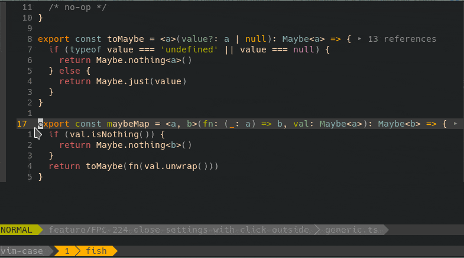
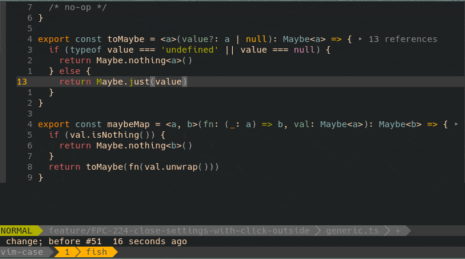

# **vim-case**

Easily switch cases between camelCase, snake_case, kebap-case.

## Installation
Install using your favorite package manager, or use Vim's built-in package support:

**Example installing using vim-plug**
```vimrc
Plug "pehota/vim-case"
```


## Usage
The case can be switched either by executing the `CaseSwitch {case}` command with the relevant case as an argument,  
or by using the mappings.
With nothing selected, the plugin will change the case of the current word.  
In visual mode the case change will happen on the selection.   

Valid values for the command `{case}` argument are:
- camel - for camelCase
- snake - for snake_case
- kebab - for kebab-case

**Example using the CaseSwitch command**


**Example using key mappings**


The plugin comes with the following pre-defined mappings available in normal and visual modes (nmap, xmap, vmap):  
- `<localleader>c` - convert to camel case
- `<localleader>s` - convert to snake case
- `<localleader>k` - convert to kebab case

All mappings can be overridden by the user by mapping the following commands:

`<Plug>CaseSwitchCamel`
	Switch to camel case

`<Plug>CaseSwitchSnake`
	Switch to snake case

`<Plug>CaseSwitchKebab`
	Switch to kebab case


## Known issues
- converting from kebab case doesn't work currently
